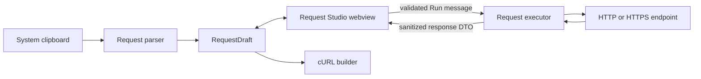

# 02 — Technical Architecture

## High-level design



The webview owns presentation state. The extension host owns clipboard access, parsing, validation, network execution, cancellation, persistence, and secret handling.

## Proposed source structure

```text
src/
  extension.ts
  requestParser.ts
  requestStudio/
    model.ts
    messages.ts
    panel.ts
    clipboardWatcher.ts
    executor.ts
    redirectPolicy.ts
    responseReader.ts
    redaction.ts
    history.ts
  webview/
    main.ts
    state.ts
    styles.css
    components/
      requestToolbar.ts
      paramsEditor.ts
      headersEditor.ts
      bodyEditor.ts
      responseViewer.ts
      notice.ts
test/
  requestParser.test.ts
  executor.test.ts
  redirectPolicy.test.ts
  requestStudio.integration.test.ts
```

Keep `extractors.ts`, `normalizer.ts`, and `curlBuilder.ts` as framework-independent modules. Refactor orchestration out of `extension.ts` so both the existing command and Request Studio consume one parser API.

## Domain model

```ts
export type HttpMethod =
  | 'GET' | 'POST' | 'PUT' | 'PATCH'
  | 'DELETE' | 'HEAD' | 'OPTIONS';

export interface EditablePair {
  id: string;
  name: string;
  value: string;
  enabled: boolean;
  sensitive?: boolean;
}

export interface RequestBody {
  mode: 'none' | 'json' | 'text' | 'form';
  text: string;
  contentType?: string;
}

export interface RequestDraft {
  id: string;
  method: HttpMethod;
  url: string;
  query: EditablePair[];
  headers: EditablePair[];
  body: RequestBody;
  sourceLog?: string;
  importedAt: number;
}

export interface ResponseSnapshot {
  requestId: string;
  status: number;
  statusText: string;
  headers: EditablePair[];
  bodyText: string;
  contentType?: string;
  durationMs: number;
  sizeBytes: number;
  finalUrl: string;
  receivedAt: number;
  truncated: boolean;
}
```

IDs prevent a late response from an older request replacing the result of a newer request.

## Parser facade

Create:

```ts
parseLogToRequestDraft(text: string): ParseResult
```

`ParseResult` should return either a valid draft or structured diagnostics. It should:

1. Isolate the first complete request block.
2. Extract method, URL, query, headers, and body.
3. Deduplicate the Authorization representation.
4. Preserve duplicate query parameters and headers where possible.
5. Mark sensitive headers.
6. Return warnings for partial bodies or multiple detected requests.

The existing cURL command must call this same facade to prevent the two features from parsing logs differently.

## Webview panel

Use `vscode.window.createWebviewPanel` with:

- `enableScripts: true`.
- `retainContextWhenHidden: false` unless profiling proves it necessary.
- `localResourceRoots` restricted to compiled webview assets.
- A nonce-based Content Security Policy.
- No remote scripts, styles, fonts, or images.

Use VS Code theme variables so the panel follows Cursor/VS Code themes. Render server content with `textContent`, never `innerHTML`.

The webview should be bundled into a browser-targeted JavaScript asset. Use a small bundler such as esbuild; do not load Node APIs in webview code.

## Message protocol

Webview to extension host:

- `ready`
- `importClipboard`
- `runRequest`
- `cancelRequest`
- `copyCurl`
- `updateDraft`
- `revealSensitiveValue`

Extension host to webview:

- `hydrate`
- `clipboardCandidate`
- `requestStarted`
- `requestSucceeded`
- `requestFailed`
- `requestCancelled`
- `curlGenerated`
- `settingsChanged`

Every message must have a discriminated TypeScript union and runtime validation. Treat all incoming webview data as untrusted even though the extension created the webview.

## Request execution

Execute from the desktop extension host so browser CORS rules do not apply.

MVP execution steps:

1. Validate message schema.
2. Validate method and URL scheme.
3. Materialize enabled query parameters.
4. Normalize headers and body.
5. Apply safety and redirect policies.
6. Create an `AbortController`.
7. Start a timeout timer.
8. Send the request using the extension host's HTTP client.
9. Stream the response while enforcing the byte limit.
10. Decode text using the declared charset when supported.
11. Return a `ResponseSnapshot`.
12. Clear timers and controller references in `finally`.

Start with the Node runtime's fetch/HTTP support and place it behind a `RequestTransport` interface. This permits later replacement for proxy, certificate, HTTP/2, or cookie-jar support without changing the panel.

```ts
export interface RequestTransport {
  execute(
    request: ExecutableRequest,
    options: ExecutionOptions,
    signal: AbortSignal
  ): Promise<ResponseSnapshot>;
}
```

## Redirect policy

- Default maximum: 10 redirects.
- Resolve relative `Location` values correctly.
- Preserve ordinary headers on same-origin redirects.
- Remove `Authorization`, `Cookie`, `Proxy-Authorization`, and API-key-like headers when origin changes.
- Never downgrade HTTPS to HTTP without confirmation.
- Record the final URL and redirect count.

Implement redirects manually if the selected transport cannot enforce these rules.

## Clipboard watcher

`ClipboardWatcher` owns a single timer and exposes start/stop:

- Start when panel becomes visible and the setting is enabled.
- Read clipboard every 1000 ms.
- Hash text in memory and skip unchanged content.
- Ignore content written by Log2Curl itself.
- Parse only plausible HTTP logs.
- Notify the panel; do not mutate dirty state automatically.
- Stop on panel hide/dispose and extension deactivation.

There must never be more than one timer per extension host.

## State and persistence

MVP:

- Keep active request and response in memory.
- Use `webview.setState` only for non-secret UI state such as selected tabs.
- Do not persist headers, body, source log, or response by default.

History phase:

- Store redacted metadata in `globalState`.
- Store large opt-in history under `globalStorageUri`.
- Store named secret values using `ExtensionContext.secrets`.
- Provide Clear History and Delete Environment commands.

## Remote workspaces

Document where requests execute. With a workspace extension, Remote SSH/Containers/Codespaces may execute requests on the remote extension host, which changes network reachability. The panel should display `Running from: Local` or `Running from: <remoteName>` before Run.

Do not change `extensionKind` until local-versus-remote behavior has explicit tests and a product decision.
